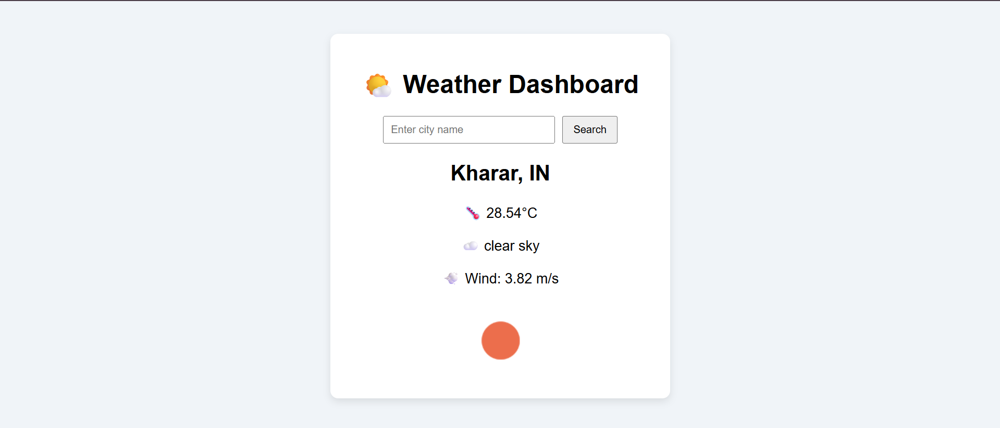

# Dynamic Weather Dashboard

A simple, interactive web app that shows real-time weather information for your current location or any city you search for. Get temperature, weather conditions, wind speed, and an icon representing the current weather — all in one place.

---

## Features

- Detects your **current location** and shows weather automatically.
- Search for **any city** worldwide.
- Displays **temperature, weather description, wind speed, and icon**.
- Built with **HTML, CSS, JavaScript**, using **OpenWeatherMap API** and **Geolocation API**.

---

## How to Run

1. **Clone the repo:**

```bash
git clone https://github.com/yourusername/weather-dashboard.git
cd weather-dashboard
Run locally:

Using VS Code Live Server: Open index.html → Right-click → Open with Live Server

Using Python server:python -m http.server 8000

Open in browser: http://localhost:8000

Add your API key:
Open script.js and replace the apiKey variable with your OpenWeatherMap key:

Usage

On page load, the app fetches weather for your current location.

Enter a city in the search bar and click Search to get weather data for that city.

Weather info includes:

City and country

Temperature (°C)

Weather description

Wind speed

Weather icon

Future Improvements

5-day weather forecast

Save favorite cities (using local storage)

Dark/light mode toggle

Smooth animations for better UX

Tech Used

HTML – structure

CSS – styling

JavaScript – API calls, geolocation, DOM updates

OpenWeatherMap API – weather data

Geolocation API – detects user location

License

Open-source under the MIT License.

Screenshot / Demo:


